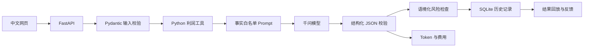

# 电商运营 AI 工作流

[](https://github.com/sqiqia/ecommerce-ai-agent/actions/workflows/tests.yml)

基于 FastAPI、千问和 SQLite 开发的中文 AI 应用作品集。系统先用 Python 工具计算可信利润，再让大模型生成结构化运营策略，并对结果执行格式校验、事实边界约束、风险检查、Token 成本记录和历史持久化。

> 项目定位：用于展示初级 AI 应用开发能力的本地作品集，不声称提升真实销量，也不包装成生产级电商 SaaS。

## 招聘方先看这里

- [真实迭代案例](docs/CASE_STUDY.md)：三次成功的真实模型调用，展示事实编造、风险误报、超时和成本问题如何被发现与修复；
- [面试讲解手册](docs/INTERVIEW_GUIDE.md)：项目介绍、技术流程、问题解决、能力证据和常见追问；
- [GitHub Actions](https://github.com/sqiqia/ecommerce-ai-agent/actions)：每次推送自动运行完整测试。

| 维度 | 已实现证据 |
|---|---|
| AI 调用 | 兼容 Chat Completions 的千问客户端、超时与异常映射 |
| 工作流 | 业务输入 → 利润工具 → Prompt → 模型 → 校验 → 风险检查 → 持久化 |
| 可靠性 | Pydantic 结构校验、Prompt 事实白名单、语境化风险检查 |
| 可观察性 | 执行轨迹、耗时、Token、预估费用、历史回放和用户反馈 |
| 数据处理 | Excel 逐行校验、批量利润分析和结果导出 |
| 可验证性 | 47 项 pytest、20 条离线案例、Fake AI Client、GitHub Actions |

## 系统架构



项目把任务分为两类：

- 利润、佣金和成本属于确定性规则，由 Python 计算；
- 文案和运营建议属于生成任务，由大模型处理。

这样可以避免让模型承担不稳定的数值计算，同时保留语言生成能力。

## 核心功能

| 功能 | 接口或入口 |
|---|---|
| 中文工作台 | `GET /` |
| 健康检查 | `GET /health` |
| 单品利润分析 | `POST /products/analyze` |
| Excel 批量分析与导出 | `POST /products/analyze-excel`、`/export` |
| Excel 任务历史 | `POST /tasks/analyze-excel`、`GET /tasks` |
| AI 文案生成 | `POST /copywriting/generate` |
| 电商运营工作流 | `POST /agent/analyze` |
| Agent 历史与回放 | `GET /agent/runs`、`GET /agent/runs/{id}` |
| 真实用户反馈 | `POST /agent/runs/{id}/feedback` |
| 自动接口文档 | `GET /docs` |

网页会展示利润工具结果、结构化策略、执行轨迹、风险状态、响应时间、Token 和预估费用。失败的模型调用不会写入成功历史记录。

## 真实迭代结果

固定案例 `CASE-001` 使用相同业务输入完成三次成功调用：

| 阶段 | 主要结果 |
|---|---|
| 初始版本 | JSON 通过，但编造赠品、试用人数、广告成本和产品能力；风险提醒被误报 |
| Prompt 1.1 | 误报消失并开始记录 Token/费用，但仍推断多设备切换、篇数和具体体验 |
| Prompt 1.2，温度 0.2 | 上述事实扩展未再次出现；4,320 Token；预估费用 ¥0.0029478；耗时 23.183 秒 |

这只是单条案例结果，不能代表全部场景，也不能证明商业效果。完整证据与实验限制见[真实迭代案例](docs/CASE_STUDY.md)。

## 技术栈

| 分类 | 技术 |
|---|---|
| 后端 | Python、FastAPI |
| 数据契约 | Pydantic |
| 大模型 | 阿里云百炼千问 |
| 数据库 | SQLite、SQLAlchemy |
| Excel | openpyxl |
| 前端 | HTML、CSS、JavaScript |
| 测试与工程化 | pytest、FastAPI TestClient、Git、GitHub Actions |

## 本地运行

推荐 Python 3.12。在项目根目录执行：

```powershell
python -m venv .venv
.\.venv\Scripts\python.exe -m pip install -r requirements.txt
Copy-Item .env.example .env
```

在本地 `.env` 中填写模型配置。真实 API Key 不要写入代码或 `.env.example`。

启动程序：

```powershell
.\.venv\Scripts\python.exe run_server.py
```

启动器会从 8000 开始寻找空闲端口，并在终端打印中文工作台、健康检查和接口文档地址。

## 测试与评测

运行47项自动化测试：

```powershell
.\.venv\Scripts\python.exe -m pytest -q
```

测试使用模拟模型与临时数据库，不访问千问，不产生模型费用。

校验20条离线案例：

```powershell
.\.venv\Scripts\python.exe -m evaluation.run_evaluation
```

默认命令不调用真实模型。付费评测必须显式添加 `--execute --confirm-paid-calls`，说明见[离线评测文档](evaluation/README.md)。

## 项目边界

- 当前是本地单用户 SQLite 应用，没有登录、权限、支付和公网部署；
- Agent 是固定、可解释的工作流，不是通用自主智能体；
- Prompt 与规则只能降低事实编造和风险误报，不能保证完全消除；
- Token 费用是按本地配置单价计算的估值，实际金额以供应商账单为准；
- 没有真实店铺对照数据，因此不声称提升销量、转化率或运营效率。
