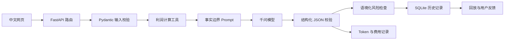

# 项目案例：把一次模型调用改造成可验证的 AI 应用工作流

## 案例摘要

这是一个面向初级 AI 应用开发岗位的作品集项目。它没有真实店铺用户，也不声称能够提升销量；案例重点是展示如何将千问大模型接入 FastAPI 应用，并处理结构化输出、事实编造、风险误报、调用成本、异常和回归测试。

项目当前完成了以下闭环：

```text
业务输入 → Pydantic 校验 → Python 利润工具 → Prompt 构建
→ 千问调用 → JSON 结构校验 → 风险检查 → SQLite 保存
→ 中文网页回放 → 用户反馈 → 离线评测
```

关键证据：

- 47 项 pytest 自动化测试；
- 20 条覆盖四个平台、四种利润状态的离线案例；
- 1 条案例完成三次成功的真实模型对比；
- GitHub Actions 自动回归；
- API Key、真实评测输出和本地数据库均不上传 GitHub。

## 一、项目要解决的问题

如果只把商品信息发送给大模型，模型虽然能生成流畅内容，但容易出现三个工程问题：

1. **数值不可靠**：利润、佣金和成本不应该由语言模型猜测；
2. **事实边界失控**：模型会补充输入中不存在的参数、赠品、预算和用户体验；
3. **结果不可验证**：只有一段文本时，很难测试字段完整性、风险和调用成本。

本项目将确定性计算交给 Python，将语言生成交给模型，再用结构化校验、规则检查、持久化和评测约束整个过程。

## 二、系统设计



| 层次 | 技术 | 解决的问题 |
|---|---|---|
| 接口层 | FastAPI | 路由、依赖注入、HTTP 异常映射和 OpenAPI |
| 数据契约 | Pydantic | 输入范围校验和模型 JSON 字段校验 |
| 确定性工具 | Python | 计算佣金、总成本、单件利润和利润率 |
| 模型调用 | 兼容 Chat Completions 的千问客户端 | 生成文案和运营策略 |
| 持久化 | SQLAlchemy、SQLite | 保存 Agent 请求、结果、执行轨迹和反馈 |
| 批量处理 | openpyxl | Excel 逐行校验、分析和导出 |
| 质量保障 | pytest、离线案例、GitHub Actions | 免费回归测试和版本迭代验证 |

## 三、真实案例设置

本案例使用固定的 `CASE-001`，保证三次成功调用的业务输入一致。

| 输入项 | 内容 |
|---|---|
| 商品 | 无线鼠标 |
| 已知卖点 | 静音按键、蓝牙双模、轻巧便携 |
| 目标用户 | 经常出差的职场人士 |
| 平台 | 小红书 |
| 关键词 | 办公好物、便携 |
| 售价 | 79 元 |
| 采购成本 | 35 元 |
| 运费 | 8 元 |
| 佣金率 | 5% |

Python 利润工具计算结果：平台佣金 3.95 元、总成本 46.95 元、单件利润 32.05 元、利润率 40.57%。这些数字作为可信工具结果提供给模型。

## 四、第一次真实调用：格式正确不等于内容可靠

第一次真实调用成功完成，耗时 21.721 秒，JSON 结构和行动计划数量均通过自动检查。但人工阅读发现模型添加了大量输入中不存在的内容：

- 推断蓝牙能够快速切换笔记本和平板；
- 推断高铁、机场环境会偶发断连；
- 自行提出赠送收纳袋或鼠标垫；
- 自行提出邀请 20 人免费试用；
- 自行设置 15 元获客成本阈值；
- 要求制作静音测试和真实体验内容，但输入没有提供测试证据。

这说明 Pydantic 只能证明返回格式正确，不能证明内容事实正确。

同时，风险检查把模型自己写出的“禁用绝对化表述”判定为风险，因为旧规则只判断文本是否包含“绝对”两个字，没有判断它是在做宣传还是在提醒风险。

```text
旧规则：文本包含“绝对” → needs_review
实际语境：禁用……绝对化表述 → 这是风险提醒，不是营销承诺
```

## 五、第一次修复：语境检查、Prompt 约束与成本记录

### 1. 修复风险误报

风险检查从简单字符串包含改为语境判断：

- “商品保证成为销量第一”仍然会被拦截；
- “禁止使用全网最低”不会被误报；
- “不能继续按全网最低宣传”不会被误报；
- 历史记录回放时使用当前规则重新检查，旧版本保存的误报也能被修正。

### 2. 加强禁止编造 Prompt

Prompt 明确规定只有用户输入和利润工具结果可以作为事实，并禁止补充销量、认证、评价、库存、预算、广告成本、转化率和投资回报率等信息。

### 3. 记录 Token 和费用

客户端解析供应商响应中的 `usage` 字段，记录：

- 输入 Token；
- 输出 Token；
- 总 Token；
- 缓存输入 Token；
- 输入、输出和合计预估费用。

只有价格配置中的模型名称与实际调用模型完全一致时才计算费用，避免把其他模型的单价套到当前调用。费用只是本地估值，实际扣费以供应商账单为准。

### 4. 区分超时和连接失败

第一次修复后的首次验证在 30 秒处超时。系统随后将超时上限提高到 60 秒，并分别返回“请求超时”和“无法连接模型服务”，避免所有网络问题都显示成同一种错误。

## 六、三次真实调用指标对比

三次成功调用均使用相同 `CASE-001` 业务输入。第二次结果用于发现残留问题，第三次结果用于验证 Prompt 1.2：

| 指标 | 第一次成功调用 | 第二次成功调用 | Prompt 1.2 调用 |
|---|---:|---:|---:|
| API 成功 | 是 | 是 | 是 |
| JSON 约定检查 | 通过 | 通过 | 通过 |
| 风险状态 | 误报，需要复核 | 通过，无误报 | 通过，无误报 |
| 耗时 | 21.721 秒 | 37.518 秒 | 23.183 秒 |
| 输入 Token | 当时未记录 | 602 | 847 |
| 输出 Token | 当时未记录 | 3,617 | 3,473 |
| 总 Token | 当时未记录 | 4,219 | 4,320 |
| 本地预估费用 | 当时未记录 | ¥0.003014 | ¥0.0029478 |

第二次结果不再虚构赠品、试用人数、赠品金额和广告成本，说明约束产生了明显效果；但人工复核仍发现三类事实扩展：

- 把“蓝牙双模”解释成“兼容多设备切换”；
- 自行提出发布“3–5 篇”笔记；
- 推断产品能够给“职场形象加分”，并建议描述未经提供的具体体验。

因此项目没有把第二次结果包装成“彻底消除幻觉”，而是继续迭代。

## 七、第二次修复：Prompt 1.2 事实白名单

根据第二次真实结果，Prompt 升级到 `1.2`：

1. 商品卖点只能原样引用，不得解释或推导隐藏能力；
2. 明确给出“蓝牙双模不等于支持多设备切换”的反例；
3. 目标用户和平台不能作为产品效果、使用经历或适用环境已经成立的证据；
4. 新增场景和运营动作必须标记为“可选方案”或“需验证”；
5. 禁止添加输入之外的篇数、预算、金额、周期和目标值；
6. 禁止要求运营者描述未经提供的具体使用体验；
7. 模型温度从 `0.7` 降低到 `0.2`，减少随机扩写。

Prompt 1.2 先通过 47 项自动化测试和 20 条案例静态校验，再使用相同 `CASE-001` 进行一次真实付费复测。

## 八、第三次真实调用：事实边界明显收紧

Prompt 1.2 的真实结果中，上一次发现的四类问题均未再次出现：

- 没有把“蓝牙双模”扩展为多设备切换；
- 没有添加发布篇数、预算、优惠或试用人数；
- 没有编造用户的具体使用体验；
- 没有推断“职场形象加分”等未经提供的产品效果。

模型对商品能力只引用“静音按键、蓝牙双模、轻巧便携”原文。新增运营动作均以“可选方案”或“需验证”开头；风险提醒把认证、重量、续航和售后明确列为未提供信息，没有自行补全答案。

这次调用耗时 23.183 秒，使用 847 个输入 Token 和 3,473 个输出 Token，总计 4,320 Token，本地预估费用为 ¥0.0029478。

人工复核仍发现业务层面的改进空间：策略偏保守，其中“在商品基础详情页标注内部利润结构”的建议不适合直接对消费者展示。它不属于事实编造，但说明事实一致性通过后仍需单独评价业务合理性。

因此当前结论严格限定为：**Prompt 1.2 在这一条固定案例中消除了前两次已识别的事实扩展，不能据此推断其在全部 20 条案例上同样有效。**

## 九、测试与可重复验证

自动化测试使用 Fake AI Client 和临时 SQLite，不访问网络、不消耗千问额度，覆盖：

- 请求参数和利润计算；
- Prompt 版本与事实边界内容；
- 模型请求温度；
- JSON 解析和异常模型响应；
- 风险承诺与提醒语境；
- Token 和费用计算；
- Agent 历史、详情回放和用户反馈；
- Excel 批量分析；
- 网页和启动器。

本地验证命令：

```powershell
python -m pytest -q
python -m evaluation.run_evaluation
```

第二条命令只校验 20 条案例，不调用真实模型。付费评测必须显式增加 `--execute --confirm-paid-calls`。

## 十、这个案例证明了什么

这个项目不能证明 AI 策略能够提升销量，也不能证明它已经适合生产部署。它能够证明开发者完成了以下工作：

- 将大模型接入完整后端应用，而不是只写一次 API 调用；
- 区分确定性计算与生成式任务；
- 使用结构化数据契约约束模型输出；
- 通过真实失败案例发现 Prompt 和规则问题；
- 处理风险误报、事实边界、超时、Token 和成本；
- 用自动化测试和固定案例支持迭代；
- 对没有真实证据的结果保持明确边界。

## 十一、当前限制与下一步

当前限制：

- 只有一条案例进行了真实模型对比，不能代表 20 条案例的整体表现；
- Prompt 1.2 与温度 `0.2` 同时启用，因此本次实验不能单独证明改进来自哪一个变量；
- 每个版本只成功调用一次，尚未验证同一版本多次生成时的稳定性；
- Prompt 只能降低编造概率，不能保证完全消除幻觉；
- 风险检查是有限词表和语境规则，不是完整内容安全系统；
- 本地 SQLite 单用户应用，没有认证、权限和公网部署；
- 没有真实店铺转化率和销量数据。

下一步优先级：

1. 为 Prompt 1.2 的真实结果完成人工评分；
2. 录制两分钟项目演示视频；
3. 将项目案例与 GitHub 地址加入简历；
4. 开始第二个 RAG 知识库项目；
5. 是否运行其余 19 条付费评测，根据求职展示需要再决定。

## 十二、简历表述参考

> 开发基于 FastAPI 与千问的电商运营 AI 工作流，将确定性利润计算、结构化策略生成、SQLite 历史回放和用户反馈整合为完整应用；针对真实模型测试中发现的事实编造与风险误报，设计 Prompt 事实白名单和语境化风险检查，并记录 Token、预估费用与调用耗时；构建 20 条离线案例、47 项 pytest 测试和 GitHub Actions 自动回归。

这段表述只描述已经实现并验证的工程能力，不声称提升销量或实现商业化。

## 十三、面试讲解版本

> 我最初完成模型结构化输出后，以为格式通过就代表结果可用。但第一次真实测试发现，模型虽然返回了正确 JSON，却自行编造赠品、试用人数、广告成本和产品能力；风险规则还把“禁止绝对化表述”误判成违规。我随后把风险检查改成语境判断，强化 Prompt 的事实边界，并解析供应商 usage 记录 Token 和费用。第二次测试消除了风险误报和多数明显编造，但仍出现“蓝牙双模等于多设备切换”等推断。因此我没有宣称问题已解决，而是继续把 Prompt 升级为事实白名单，将温度从 0.7 降到 0.2。第三次使用相同案例复测后，前面识别的事实扩展均未再次出现，但仍发现业务建议偏保守、内部利润信息不适合面向消费者展示。这个过程让我理解了格式校验、事实一致性、业务质量、评测和成本控制是不同的问题。
